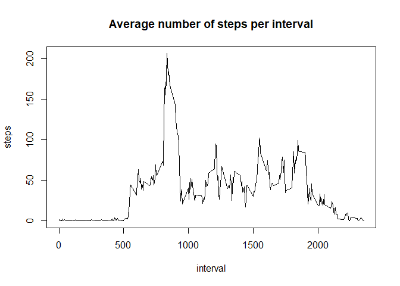

##Download and read data

First, we download the data with the link provided in the assignment, unzip it, and ensure all variables are in a proper format.


```r
download.file("https://d396qusza40orc.cloudfront.net/repdata%2Fdata%2Factivity.zip", 
              destfile = "reprod_assignment_1.zip")
unzip("reprod_assignment_1.zip")
data <- read.csv("activity.csv", header = TRUE)
data$date <- as.Date(data$date)
str(data)
```

```
## 'data.frame':	17568 obs. of  3 variables:
##  $ steps   : int  NA NA NA NA NA NA NA NA NA NA ...
##  $ date    : Date, format: "2012-10-01" "2012-10-01" ...
##  $ interval: int  0 5 10 15 20 25 30 35 40 45 ...
```


##What is mean total number of steps taken per day? For this part, we can ignore the missing values in the dataset. 

###1. Total number of steps per day


```r
steps_day <- with(data, aggregate(steps, by = list(date), sum))
names(steps_day) <- c("date", "steps")
print(steps_day)
```

```
##          date steps
## 1  2012-10-01    NA
## 2  2012-10-02   126
## 3  2012-10-03 11352
## 4  2012-10-04 12116
## 5  2012-10-05 13294
## 6  2012-10-06 15420
## 7  2012-10-07 11015
## 8  2012-10-08    NA
## 9  2012-10-09 12811
## 10 2012-10-10  9900
## 11 2012-10-11 10304
## 12 2012-10-12 17382
## 13 2012-10-13 12426
## 14 2012-10-14 15098
## 15 2012-10-15 10139
## 16 2012-10-16 15084
## 17 2012-10-17 13452
## 18 2012-10-18 10056
## 19 2012-10-19 11829
## 20 2012-10-20 10395
## 21 2012-10-21  8821
## 22 2012-10-22 13460
## 23 2012-10-23  8918
## 24 2012-10-24  8355
## 25 2012-10-25  2492
## 26 2012-10-26  6778
## 27 2012-10-27 10119
## 28 2012-10-28 11458
## 29 2012-10-29  5018
## 30 2012-10-30  9819
## 31 2012-10-31 15414
## 32 2012-11-01    NA
## 33 2012-11-02 10600
## 34 2012-11-03 10571
## 35 2012-11-04    NA
## 36 2012-11-05 10439
## 37 2012-11-06  8334
## 38 2012-11-07 12883
## 39 2012-11-08  3219
## 40 2012-11-09    NA
## 41 2012-11-10    NA
## 42 2012-11-11 12608
## 43 2012-11-12 10765
## 44 2012-11-13  7336
## 45 2012-11-14    NA
## 46 2012-11-15    41
## 47 2012-11-16  5441
## 48 2012-11-17 14339
## 49 2012-11-18 15110
## 50 2012-11-19  8841
## 51 2012-11-20  4472
## 52 2012-11-21 12787
## 53 2012-11-22 20427
## 54 2012-11-23 21194
## 55 2012-11-24 14478
## 56 2012-11-25 11834
## 57 2012-11-26 11162
## 58 2012-11-27 13646
## 59 2012-11-28 10183
## 60 2012-11-29  7047
## 61 2012-11-30    NA
```

###2. Histogram of the total number of steps taken per day


```r
hist(steps_day$steps, main = "Total number of steps taken per day", 
     xlab = "Steps per day", ylab = "Number of days")
```

<!-- -->

###3. Calculate the mean and the median of steps taken per day


```r
mean(steps_day$steps, na.rm = TRUE)
```

```
## [1] 10766.19
```

```r
median(steps_day$steps, na.rm = TRUE)
```

```
## [1] 10765
```


##What is the average daily activity pattern? 

###1.Time series plot of the 5-minute interval (x) and average number of steps taken, averaged across all days (y)


```r
steps_interval <- with(data, aggregate(steps, by = list(interval), mean, na.rm = TRUE))
names(steps_interval) <- c("interval", "steps")
with(steps_interval, plot(interval, steps, type = "l", main = "Average number of steps per interval"))
```

<!-- -->

###2.Which 5-minute interval contains on average the maximum number of steps?


```r
max_interval <- steps_interval[steps_interval$steps == max(steps_interval$steps), ]
print(max_interval, row.names = FALSE)
```

```
##  interval    steps
##       835 206.1698
```


##Imputing missing values 

###1.Calculate the total number of missing values in the dataset


```r
table(is.na(data$steps))
```

```
## 
## FALSE  TRUE 
## 15264  2304
```

###2.Devise a strategy for filling in all of the missing values in the dataset. We need to know if the NA are complete days or parts of a day


```r
x <- with(data, aggregate(is.na(steps), by = list(date), mean))
unique(x$x)
```

```
## [1] 1 0
```

There are days with no NA and days with all NA. Then we will make an imputation using the values of +/-2 days for each day with missing steps values. For this, we create a function that:

1. Checks that the data column is in a proper format 

2. Identifies the list of days with missing values 

3. Creates a list with the surrounding days, 2 before, 2 after the date with missing values (the function will exclude the surrounding days with missing values themselves), 

4. Calculates a mean value for each interval using the surrounding days data 

5. Assigns these values to the days with missing data in a new dataframe


```r
imput <- function(data){
    if (!inherits(data$date, "Date")) {
        stop("The 'date' column is not in date format")
    }
    d_na <- unique(data$date[is.na(data$steps)])
    data_i <- data
    for (na_date in d_na){
        d_range <- seq(na_date - 2, na_date + 2, by = 1)
        d_range <- as.Date(d_range, origin = "1970-01-01") #this transforms back to date format
        d_surr <- data[data$date %in% d_range & !is.na(data$steps), ]
        ms <- aggregate(steps ~ interval, data = d_surr, FUN = mean)
        for (interval in ms$interval) {
            data_i$steps[data_i$date == na_date & data_i$interval == interval] <-
                ms$steps[ms$interval == interval]
        }
    }
    return(data_i)
}
```

Its usage is imput(x) where x is a dataframe with 3 columns as the activity dataset: interval, data, and steps. 

###3.Create a new dataset that is equal to the original dataset but with the missing data filled in. We use the previous function to cereate a new dataset with the imputation of the surrounding days


```r
data_i <- imput(data)
table(is.na(data_i$steps))
```

```
## 
## FALSE 
## 17568
```

###4.Make a histogram of the total number of steps taken each day and Calculate and report the mean and median total number of steps taken per day. Do these values differ from the estimates from the first part of the assignment? What is the impact of imputing missing data on the estimates of the total daily number of steps?


```r
steps_day_i <- with(data_i, aggregate(steps, by = list(date), sum))
names(steps_day_i) <- c("date", "steps")
hist(steps_day_i$steps, main = "Total number of steps taken per day (after imputation)", 
     xlab = "Steps per day", ylab = "Number of days")
```

<!-- -->

```r
mean(steps_day_i$steps, na.rm = TRUE)
```

```
## [1] 10543.69
```

```r
median(steps_day_i$steps, na.rm = TRUE)
```

```
## [1] 10571
```

After imputation we see that there are a larger number of days with data, mainly in the 5000 to 10000 histogram break. This caused a slight decrease in the mean and the median, more pronounced for the mean.


##Are there differences in activity patterns between weekdays and weekends? 

###1. Create a new factor variable in the dataset with two levels – “weekday” and “weekend” indicating whether a given date is a weekday or weekend day.


```r
data_i$wd <- as.factor(ifelse(weekdays(data_i$date) %in% c("sábado", "domingo"), "weekend", "weekday"))
```

###2. Make a panel plot containing a time series plot of the 5-minute interval (x-axis) and the average number of steps taken, averaged across all weekday days or weekend days (y-axis).


```r
si_weekday <- with(data_i[data_i$wd == "weekday",], aggregate(steps, by = list(interval), mean, na.rm = TRUE))
names(si_weekday) <- c("interval", "steps")
si_weekend <- with(data_i[data_i$wd == "weekend",], aggregate(steps, by = list(interval), mean, na.rm = TRUE))
names(si_weekend) <- c("interval", "steps")
par(mfrow = c(2, 1), mar = c(4, 4, 2, 2), oma = c(0, 0, 2, 0))
with(si_weekday, plot(interval, steps, type = "l", ylim = c(0, 220), main = "Weekday"))
with(si_weekend, plot(interval, steps, type = "l", ylim = c(0, 220), main = "Weekend"))
mtext("Average number of steps per interval", outer = TRUE)
```

<!-- -->
